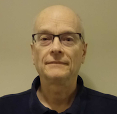

# Inference of particle sensor measurements: Beyond analytic models

## Date: 13.04.2021, 16:00 CET
<!--

<a href="https://logwork.com/countdown-timer" class="countdown-timer" data-timezone="Europe/Oslo" data-date="2021-04-13 16:00">The meeting will start in</a>
-->
## Speaker: 
### [Prof. Richard Marchand, University of Alberta, Edmonton, Canada](https://sites.ualberta.ca/~rmarchan/) 

Prof. Marchand is an expert on Computational Physics. His interest lies in physics of spacecraft interaction with space environment, ionospheric and magnetospheric physics, Particle-in-Cell (PIC) simulations, finite elements, structured and unstructured meshes.

## Abstract
The accurate inference of plasma parameters from particle sensor measurements remains a daunting challenge, despite of the many experimental and theoretical studies reported over nearly a century. Thus far, due to the need for “light weight” fast algorithms in lab or space experiments, inferences have almost exclusively been based on approximate analytic expressions. The use of computer modelling combined with multivariate regressions is presented as a promising alternative. Computer simulations can be used to calculate sensor responses under realistic conditions, and used to construct data sets from which regression models can be trained and validated, to infer plasma conditions from low level L1B measurements. Combined with dedicated campaigns of measurements, this could lead to a change of paradigm in the inference of probe and sensor measurements.

## Slides
[Download Slides](assets/slides/talk01.pdf)
