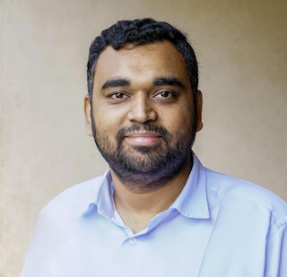

# Alfven waves: _scatter, _gather

## Date: 14.09.2021, 14:00 CET

<a href="https://logwork.com/countdown-qeg8" class="countdown-timer" data-timezone="Europe/Oslo" data-date="2021-09-14 14:00">The meeting will start in</a>
## Speaker: 
### [Dr. Rupak Mukherjee, PPPL, New Jersey, USA](https://theory.pppl.gov/people/profile.php?pid=155&n=Rupak-Mukherjee) 

Dr Rupak Mukherjee is Associate Research Physicist at Theory department, PPPL, Princeton University, USA. He has obtained his PhD in 2019 from Institute for Plasma Research, India. His thesis topic was the study of turbulence, flows and magnetic field generation in plasmas using a Magnetohydrodynamic model.

He is currently working in the "Gkeyll" project [a discontinuous-Galerkin method-based code for simulation of instabilities and turbulence in magnetically confined plasma devices as well as space and astrophysical plasmas] with Prof Greg Hammett and Dr Ammar Hakim. He is primarily contributing to improve the code's capability to resolve magnetic null points in general geometry.

## Abstract
Fifty one years ago Hannes Alfven won the prestigious Nobel prize "_for fundamental work and discoveries in magneto-hydrodynamics with fruitful applications in different parts of plasma-physics_". Since then, Alfven waves have explained many surprises of nature, both terrestrial as well as in _3D-space_. With time, the fulcrum of theoretical research shifted from analytical to more computationally-involved. Thus Alfven waves are now-a-days simulated in high-performance-supercomputers to understand solar coronal heating or the plasma turbulence inside laboratory fusion devices. Most of these studies talk about the decay processes of Alfven waves in plasma. On the contrary, I will hinge around some new analytical as well as numerical-heavy observation of scattering of Alfven waves and further restoration of the wave-structure. This recently discovered nonlinear oscillatory phenomena certainly deserves credit "_for the significant contribution in Recurrence in three dimensional magnetohydrodynamic plasma_".

## Slides
[Download Slides](#)

